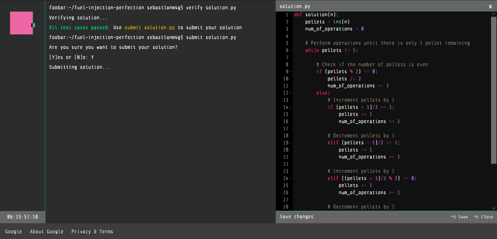

# Google FooBar

> Google Foobar is an invitation-only coding challenge created by Google. 
> It presents users with a series of progressively difficult 
> programming problems to solve.

 

    

> Featuring a wide array of algorithmic problems, 
> including but not limited to graph theory, dynamic programming, 
> string manipulation, data structures, recursion, sorting, 
> searching, optimization and mathematical puzzles.

----

### Level 1
- [I love Lance & Janice](level-1/i-love-lance-and-janice)
- [Minion Labor Shifts](level-1/minion-labor-shifts)
- [Re-ID](level-1/re-id)
- [Skipping Work](level-1/skipping-work)
- [Solar Doomsday](level-1/solar-doomsday)
- [The cake is not a lie!](level-1/the-cake-is-not-a-lie)

### Level 2
- [Bunny Worker LocationsVolunteered!](level-2/bunny-worker-locations)
- [Don't Get Volunteered!](level-2/dont-get-volunteered)
- [En Route Salute](level-2/en-route-salute)
- [Hey, I Already Did That!](level-2/hey-i-already-did-that)
- [Ion Flux Relabeling](level-2/ion-flux-relabeling)
- [Please Pass the Coded Messages](level-2/please-pass-the-coded-messages)
- [Power Hungry](level-2/power-hungry)

### Level 3
- [Bomb, Baby!](level-3/bomb-baby)
- [Find the Access Codes](level-3/find-the-access-codes)
- [Fuel Injection Perfection](level-3/fuel-injection-perfection)
- [Prepare the Bunnies' Escape](level-3/prepare-the-bunnies-escape)
- [The Grandest Staircase Of Them All](level-3/the-grandest-staircase-of-them-all)

### Level 4
- [Bringing a Gun to a Guard Fight](level-4/bringing-a-gun-to-a-guard-fight)
- [Escape Pods](level-4/escape-pods)
- [Running with Bunnies](level-4/running-with-bunnies)

### Level 5
- [Dodge the Lasers!](level-5/dodge-the-lasers)
- [Expanding Nebula](level-5/expanding-nebula)

----

